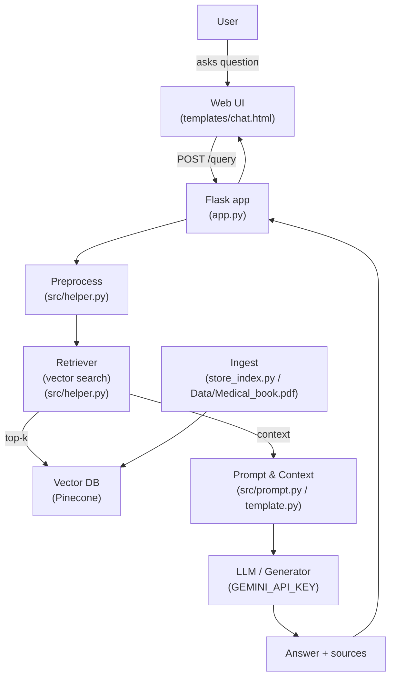

# 🩺 Medical-QA-Chatbot-RAG

An end-to-end Retrieval-Augmented Generation (RAG) medical QA chatbot built with Flask, Pinecone (vector DB), and Gemini-like LLM/embeddings.

✨ What this repo does
- Ingests clinical/medical documents (PDF), creates embeddings, stores vectors in Pinecone, and serves a small Flask chat UI that retrieves relevant context and generates answers with an LLM.

🚀 Quick demo architecture



🧭 Quick start (local)

1. Create Python environment (conda or venv)

```powershell
# conda
conda create -n medibot python=3.10 -y; conda activate medibot

# or venv
python -m venv .venv; .\.venv\Scripts\Activate.ps1
```

2. Install dependencies

```powershell
pip install -r requirements.txt
```

3. Add credentials (DO NOT COMMIT)

Create a `.env` file in the project root and set your keys:

```ini
PINECONE_API_KEY="your_pinecone_api_key"
GEMINI_API_KEY="your_llm_or_embedding_key"
FLASK_SECRET_KEY="a-secret-for-sessions"
```

4. Ingest documents to the vector DB

```powershell
python store_index.py
```

5. Run the app

```powershell
python app.py
```

Open http://127.0.0.1:5000/ and start asking questions. ✨

📁 Files & mapping
- `app.py` — Flask server and endpoints
- `store_index.py` — ingestion: PDF -> chunks -> embeddings -> Pinecone upsert
- `src/helper.py` — helpers: chunking, embedding calls, retrieval and postprocess
- `src/prompt.py`, `template.py` — prompt templates and few-shot scaffolding
- `Data/Medical_book.pdf` — sample document used for ingestion
- `templates/chat.html`, `static/style.css` — frontend
- `.env` — environment variables (`PINECONE_API_KEY`, `GEMINI_API_KEY`, `FLASK_SECRET_KEY`)

🔒 Security & safety
- Never commit `.env` or secrets to git. Add `.env` to `.gitignore`.
- Rotate API keys if they were exposed.
- Sanitize user input and limit the context size passed to the LLM to reduce hallucinations and cost.

✨ Nice-to-haves (next steps)
- Add tests for `store_index.py` and retrieval logic.
- Add a reranker (cross-encoder) to improve relevance.
- Implement streaming responses in `app.py` for a better UX.

📝 License & Contributing
- See `LICENSE` for licensing details. Contributions welcome — open an issue or PR.

----
If you want, I can also embed an SVG architecture diagram (add it as `docs/diagram.svg`) or create `docs/architecture.md` with this Mermaid rendering.
